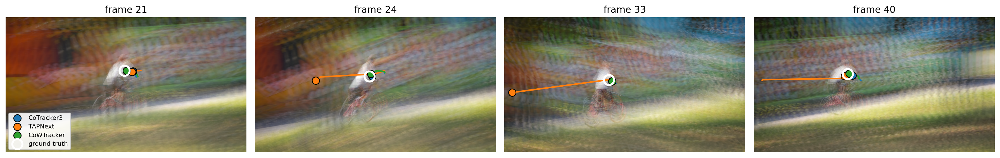
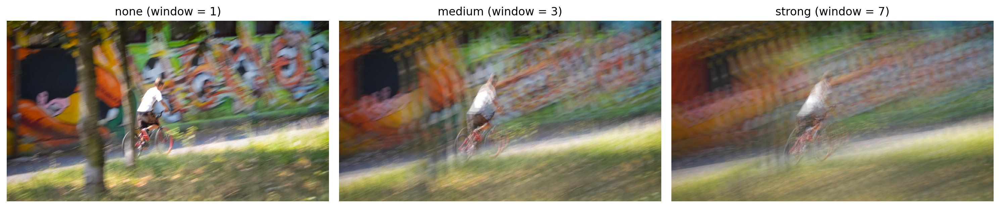
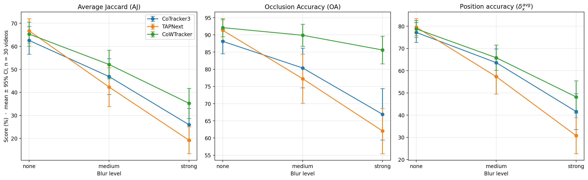
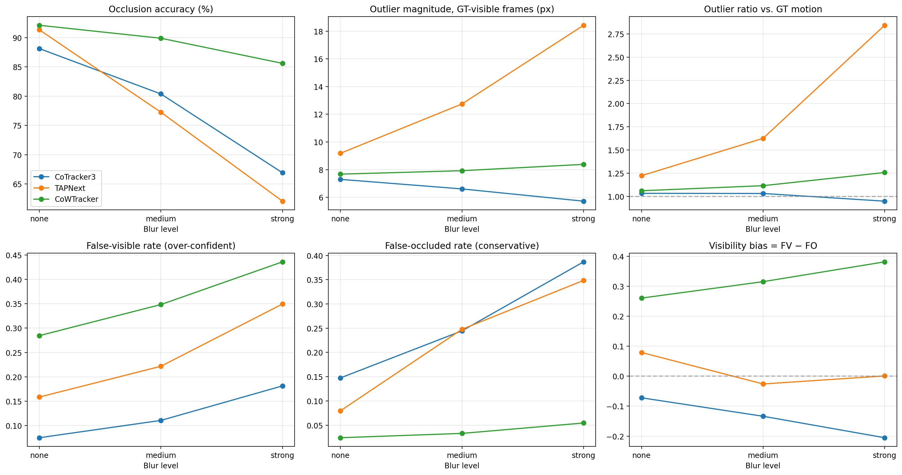

# Stress-Testing the Robustness of State-of-the-Art Point Trackers

Bachelor thesis project (LMU Munich, Informatik). It measures how three state-of-the-art
point trackers — **CoTracker3**, **TAPNext** and **CoWTracker** — degrade under synthetic
motion blur on the TAP-Vid-DAVIS benchmark, and characterises how CoTracker3 and TAPNext fail.

*DAVIS sequence `bmx-trees` (video 22) under strong blur. Coloured markers are the predictions of
CoTracker3 (blue), TAPNext (orange) and CoWTracker (green), the white ring is the ground truth.
In frames 24 and 33 TAPNext has jumped away from the point, the other two models stay on it.*

## The two experiments

**Experiment 1 — Degradation study (TAP-Vid metrics: AJ, OA, δ_avg).**
All three models are run at three blur levels (`none` / `medium` / `strong`) and scored with the
official TAP-Vid metrics Average Jaccard (AJ), **Occlusion Accuracy (OA)** and position accuracy
(δ_avg). Per-video statistics (mean, std, 95 % CI), relative degradation and paired Wilcoxon
signed-rank tests answer *how much* each tracker degrades and whether the clean ranking survives.
The occlusion-accuracy result (CoWTracker loses 6.5 pp, CoTracker3 21.2 pp, TAPNext 29.3 pp)
comes from this experiment.

**Experiment 2 — Outlier and visibility analysis (outlier magnitude, outlier ratio, FV / FO rates).**
CoTracker3 and TAPNext are re-run with per-trajectory diagnostics that describe *how* they fail:
the **outlier magnitude** (largest frame-to-frame jump on ground-truth-visible frames), its ratio
to the true motion, the false-visible and false-occluded rates and a qualitative trajectory
example. CoWTracker is evaluated on the same diagnostics as a reference.

## Method

**Motion blur.** A blurred frame is the average of `w` consecutive frames centred on it, computed
in linear radiometric space. The linear-to-sRGB conversion of Chen & Clark,
["Image as an IMU"](https://arxiv.org/abs/2503.17358) (their Eq. 2), is approximated by the
γ = 2.2 gamma curve of the GoPro dataset (Nah et al., 2017):

    B_i = ( mean_{j in W(i)} I_j^γ )^(1/γ),    W(i) = [i - floor(w/2), i + floor(w/2)]

Levels: `none` (w = 1), `medium` (w = 3), `strong` (w = 7). Two deliberate deviations from the
reference method: the window is **centred** on the annotated frame (TAP-Vid ground truth is
defined per frame), and **no frame interpolation** (RIFE) is applied before averaging, so fast
motion produces ghosting. With DAVIS at 24 fps the windows correspond to nominal exposures of
about 125 ms and 292 ms — an extreme stress test, not a calibrated camera model.

**Evaluation.** TAP-Vid-DAVIS, 30 videos, 650 trajectories, query mode `first`, 256×256, official
`tapnet` metric code. Blur is applied at 256×256 *before* any model-specific pre-processing, so
all trackers see identical degraded frames.

**Models.**

| Model | Checkpoint | Notes |
|---|---|---|
| CoTracker3 | `scaled_offline.pth` | offline, whole video in one window (time embedding interpolated beyond 60 frames), 5×5 support grid, visibility > 0.9 |
| TAPNext | `bootstapnext_ckpt.npz` (BootsTAPNext-B) | causal per-frame decoding, visible if visibility · certainty > 0.5 (6 px radius, JAX demo default) |
| CoWTracker | `cowtracker_model.pth` | dense; input up-sampled 256→448, queries read by bilinear interpolation, forward + time-reversed pass, fp16, visibility > 0.5 |

## Results

### Experiment 1 — Degradation

Mean over 30 videos (full statistics in `updated_results_experiment1and2/`):

| Model | Blur | AJ | OA | δ_avg |
|---|---|---|---|---|
| CoTracker3 | none | 62.6 | 88.1 | 77.2 |
| CoTracker3 | medium | 46.9 | 80.4 | 63.6 |
| CoTracker3 | strong | 26.0 | 66.9 | 41.6 |
| TAPNext | none | **66.7** | 91.3 | **79.6** |
| TAPNext | medium | 42.3 | 77.3 | 57.3 |
| TAPNext | strong | 19.2 | 62.1 | 30.8 |
| CoWTracker | none | 65.3 | **92.1** | 78.8 |
| CoWTracker | medium | **52.1** | **89.9** | **65.8** |
| CoWTracker | strong | **35.3** | **85.6** | **48.2** |

Clean results reproduce the published numbers within 2 AJ (CoTracker3 64.4, BootsTAPNext-B 65.2,
CoWTracker 65.5). The ranking inverts under blur: TAPNext is first on clean video and last under
strong blur (better than CoWTracker in 1 of 30 videos, Wilcoxon p < 1e-4); relative AJ loss at
strong blur is 72 % (TAPNext), 60 % (CoTracker3) and 46 % (CoWTracker). Occlusion accuracy
separates the models most, but CoWTracker's advantage there partly reflects a visibility estimate
that is biased towards "visible" (see Experiment 2).

### Experiment 2 — Outlier and visibility analysis

CoTracker3 fails smoothly: its largest frame-to-frame jump stays at the level of the true motion
(outlier ratio ≈ 1.0 at every level) while its false-occluded rate rises from 0.15 to 0.39.
TAPNext fails by jumping: its outlier magnitude grows from 9.2 to 18.4 px, the outlier ratio
from 1.2 to 2.8, and its false-visible rate from 0.16 to 0.35. CoWTracker lies between the two in
position (no extreme jumps) but has the most over-confident visibility estimate (false-visible rate
0.29 to 0.44).

**Qualitative example.** All 25 points of `bmx-trees` under strong blur, side by side for the three
models (GIF rendered from `updated_results_experiment1and2/tracking_video22_strong.mp4`):

The full-resolution video is
[`tracking_video22_strong.mp4`](updated_results_experiment1and2/tracking_video22_strong.mp4)
(GitHub shows a download link; the GIF above plays inline).

## Repository structure

    Blur_Pipeline.ipynb                  blur function + visual check
    experiment1/                         EXPERIMENT 1 — degradation study (AJ / OA / δ_avg)
      Cotracker3Isolation.ipynb          CoTracker3: setup, inference, TAP-Vid metrics
      tapnext_demoIsolation.ipynb        TAPNext: setup, inference, TAP-Vid metrics
      CoWTrackerIsolation.ipynb          CoWTracker: setup, inference, TAP-Vid metrics
      All3CSVsUpdated.ipynb              Experiment 1 statistics and figures (final)
      AlleDreiCSVs.ipynb                 superseded first aggregation, kept for traceability
    experiment2/                         EXPERIMENT 2 — outlier and visibility analysis
      Cotracker3_Experiment2.ipynb       CoTracker3 + outlier / visibility diagnostics, incl. verification run
      TapNext_Experiment2.ipynb          TAPNext + outlier / visibility diagnostics
      cowtracker_Experiment2.ipynb       CoWTracker + the same diagnostics (reference)
      Experiment2_Plot.ipynb             Experiment 2 statistics, figures, video-22 plot, blur example
    updated_results_experiment1and2/     FINAL results used in the thesis
      cowtracker_all_videos_v4.csv         per-video metrics (90 rows = 30 videos × 3 levels)
      cotracker3_all_videos_v4.csv
      tapnext_all_videos_v4.csv
      experiment1_stats_mean_std_ci.csv    mean, std, 95 % CI
      experiment1_relative_degradation.csv
      experiment2_combined_v4.csv, experiment2_combined_3models.csv, experiment2_summary_table_v4.csv
      *_traj_video22_strong.npy            trajectories for the qualitative figure
      tracking_video22_strong.mp4 / .gif   qualitative video (all points of bmx-trees, strong blur)
      *.png / *.pdf                        figures (English labels)
    results_experiment1and2/             ARCHIVE of earlier runs (v1–v4 intermediates, superseded plots)

Note on the archive: v1 used integer-rounded CoWTracker queries (clean AJ 56.9) and an outlier
metric that included occluded frames; both were replaced (v3/v4). With one exception, files in the
archive are not used in the thesis: the trajectory length ratio of CoTracker3 and TAPNext reported
in Section 4.3 is taken from `results_experiment1and2/results_v2/experiment2_combined_v3.csv`,
because the final v4 run does not include this column (its TAP-Vid metrics agree with v4 within
0.1 points). The CoWTracker length ratio comes from the final run
(`updated_results_experiment1and2/cowtracker_all_videos_v4.csv`).

## Reproducing this work

The notebooks were developed and run on Google Colab.

1. Open a notebook in Colab with a GPU runtime (An NVIDIA A100 GPU is recommended to run all 3 trackers).
2. Run all cells. Each model notebook downloads its checkpoint and TAP-Vid-DAVIS automatically
   and writes a per-video CSV; the analysis notebooks read those CSVs and produce tables and figures.
3. Inference of CoTracker3 and CoWTracker is deterministic; TAPNext varies by about 0.1 points
   between runs. A verification run of the CoTracker3 Experiment 2 notebook on 17 Sep 2026
   reproduced the committed result file exactly (max. absolute difference 0.0 over 90 rows × 18
   columns, and 0.0 px for the saved trajectories).

Environment work-arounds handled in the notebooks: repositories are fetched as ZIP archives,
a TensorFlow import in the TAP-Vid utilities is stubbed out, and a FlashAttention signature
patch is applied to CoWTracker for recent `timm` versions.

## Models

- [CoTracker3](https://cotracker3.github.io/) — Karaev et al., ICCV 2025
- [TAPNext](https://arxiv.org/abs/2504.05579) — Zholus et al., ICCV 2025
- [CoWTracker](https://cowtracker.github.io/) — Lai et al., CVPR 2026

## Status

Experiments complete; thesis submission 22 September 2026.
